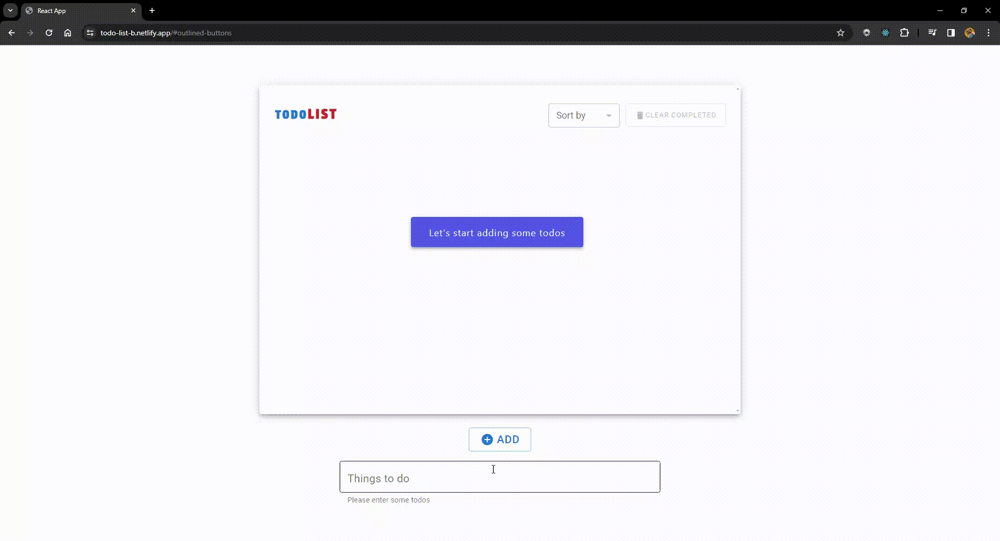

# 🚀 React Todo List Uygulaması - Material UI ile Zenginleştirilmiş
* Kullanıcı dostu arayüz için Material UI kütüphanesini tercih ettim ve bu sayede uygulamaya modern ve şık bir görünüm kazandırdım.
## Canlı versiyon : <a href="https://daily-planner-react.netlify.app/">Todo List</a>
## Öne Çıkan Özellikler:
### ✅ useReducer ve Context API: 
 * Veri yönetimini güçlendirmek için useReducer ve Context API'yi kullanarak uygulamayı daha modüler ve sürdürülebilir hale getirdim.
### 🎨 Material UI Entegrasyonu: 
 * Kullanıcı arayüzü tasarımında Material UI'nin sunduğu zengin bileşenleri kullanarak estetik ve kullanıcı dostu bir deneyim sağladım.
### 📝 Gelişmiş Todo Yönetimi:
 * Todo ekleme, silme, düzenleme gibi temel özelliklerin yanı sıra tamamlanmış görevleri filtreleme, tarihe ve alfabeye göre sıralama gibi gelişmiş fonksiyonları da ekledim.

   
